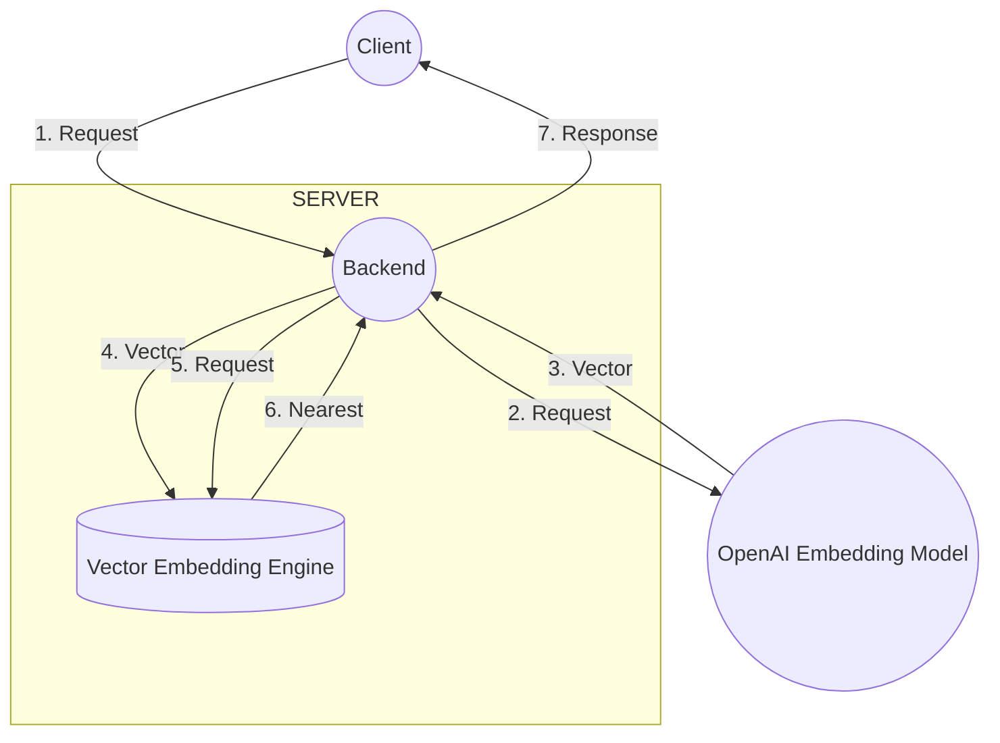

# Documentation Embedding

This tool provides a fast and efficient way to convert text into vector embeddings and store them in the Qdrant search engine. Built with Rust, this tool is designed to handle large datasets and deliver lightning-fast search results.

## Features

- Convert text into vector embeddings using popular AI libraries such as ChatGPT, BERT or FastText
- Store vector embeddings in the Qdrant search engine for fast and efficient search
- Use a REST API to query the search engine and retrieve similar texts or documents

## Flowchart

## Settings

- Qdrant ([here is a template for using Docker](https://github.com/liuliuOD/Dockerize-Templates/tree/main/Qdrant))
- Rust
